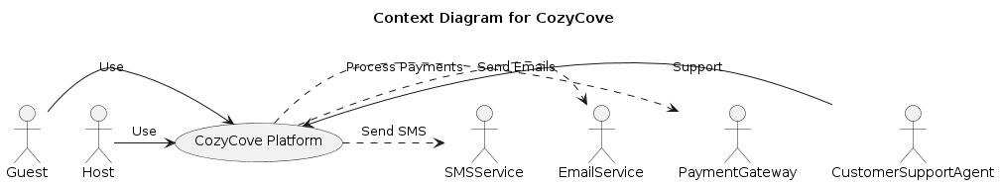

# Airbnb Architecture

## System Context Diagram

The system context diagram shows the interactions between the Airbnb system and its users and external systems.



```puml
@startuml
title Airbnb System Context Diagram

actor Guest
actor Host
actor Admin
rectangle AirbnbSystem

Guest --> AirbnbSystem : Uses
Host --> AirbnbSystem : Uses
Admin --> AirbnbSystem : Administers

rectangle ExternalPaymentGateway {
  AirbnbSystem --> ExternalPaymentGateway : Processes payments with
}

rectangle ExternalIdentityProvider {
  AirbnbSystem --> ExternalIdentityProvider : Authenticates with
}

@enduml
